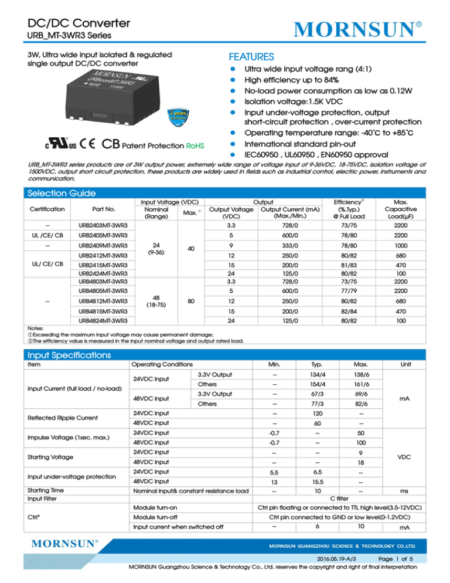
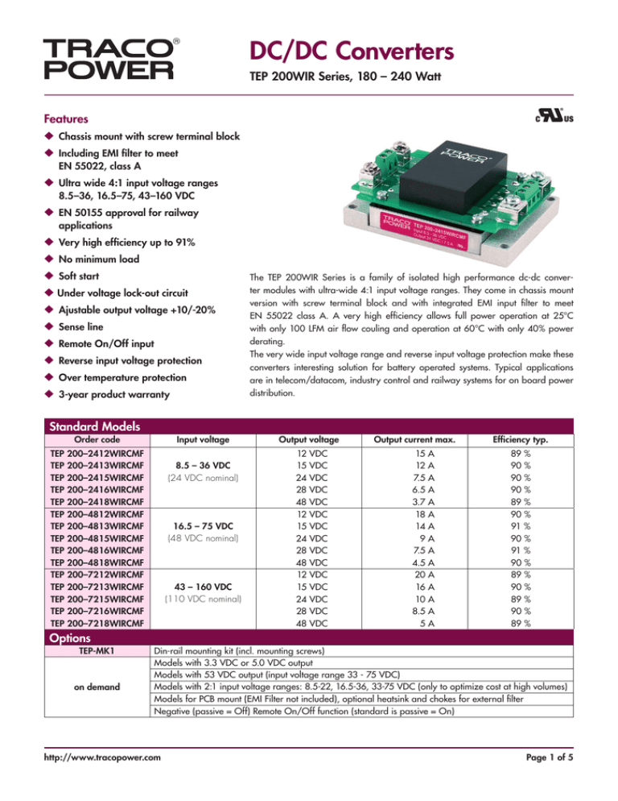

# Week 44 LinkedIn posts
#TODO

# Week 45 LinkedIn posts
#TODO

# Week 46 LinkedIn posts
This week we will focus on understanding specifications for DC/DC converters, with a structured mix of technical insights, interactive content, and engaging visuals:

## **Day 1: Monday - Introduction to DC/DC Specifications**
***"Cracking the Code of DC/DC Converter Specifications: Where to Begin?"***

Understanding the specifications of DC/DC converters is critical for designing efficient, reliable, and cost-effective systems. But datasheets can sometimes feel like a puzzle with too many pieces. Let's simplify the process by focusing on 5 key parameters every engineer must evaluate:

1️⃣ Input Voltage Range
Why it matters: Defines compatibility with your source. A wide input range (e.g., 9-36 V) offers flexibility, but might come at a trade-off in efficiency.
Pro tip: Check the impact of input voltage variations on stability and ripple.

2️⃣ Output Voltage and Current
Why it matters: Determines the load your converter can drive. Precision is critical for sensitive loads like microcontrollers or sensors.
Pro tip: Look for tolerance levels (± %) to ensure your design can handle fluctuations.

3️⃣ Efficiency
Why it matters: Impacts thermal performance, system reliability, and energy costs. High peak efficiency is great, but understanding the efficiency curve across load conditions is even better.
Pro tip: Focus on the range where your system will operate most frequently, not just the peak efficiency.

4️⃣ Power Density
Whyit matters: A high-power-density converter saves space but may require advanced thermal management.
Pro tip: Evaluate the trade-off between size and thermal performance—smaller isn't always better!

5️⃣ Ripple and Noise
Why it matters: Ripple and noise can degrade the performance of downstream components, especially in sensitive applications like RF or medical devices.
Pro tip: Pay attention to how the ripple is measured (e.g., test conditions like bandwidth or load) to avoid surprises.

🧲 Call-to-Action:
Each of these parameters has its own set of trade-offs. Understanding them will not only make your design robust but also ensure it's optimized for the application.

💬 What's the first thing you check when evaluating a DC/DC converter datasheet?
Comment below to share your go-to parameter or any specs you've found particularly challenging!

#PowerElectronics #DCtoDCConverter #EngineeringDesign #Efficiency #PowerDensity #RippleNoise #ElectricalEngineering #DesignOptimization

---

## **Day 2: Tuesday - Efficiency Across Load Conditions**
***"Efficiency: It's More Than Just the Peak Value"***

Efficiency isn't just about hitting a high peak value—it's about understanding the **efficiency curve** across different load conditions. Why? Because real-world systems rarely operate at full load 24/7. Standards like **Energy Star**, **Solar CEC**, and **EU EcoDesign** demand optimized performance profiles across a range of operating conditions, not just at the maximum power.

**Why Efficiency Curves Matter:**
1️⃣ **Light Load Efficiency**:
   - **Challenge**: At low loads, fixed losses dominate, dragging down efficiency. This is critical for systems like **solar inverters**, which spend much of their time in light load conditions at dawn, dusk, or during cloudy weather.  
   - **Impact**: Poor light load efficiency leads to wasted energy and reduced compliance with standards like **CEC (California Energy Commission)** for renewable systems.

2️⃣ **Heavy Load Efficiency**:  
   - **Challenge**: High loads introduce significant conduction and thermal losses. Systems like EV chargers must remain efficient under peak power conditions to minimize heat and maximize reliability.  
   - **Impact**: Thermal management becomes critical. Oversized heatsinks or active cooling might offset efficiency gains.

3️⃣ **Mid-Load Optimization**:  
   - **Challenge**: Standards like **Energy Star** emphasize efficiency at common load levels (e.g., 20%, 50%, 75% load). Many consumer devices operate at these points most frequently.  
   - **Impact**: Meeting these efficiency benchmarks is critical for product certification and market competitiveness.

### **Design Challenges**:
Achieving a well-rounded efficiency profile is not easy:
- **Component Selection**: MOSFETs, diodes, and magnetics all have different loss profiles across load conditions. Optimizing these components for one condition may penalize another.  
- **Topology Trade-offs**: Soft-switching converters may excel at light loads but add complexity and cost. Conversely, hard-switching designs may struggle with EMI and thermal issues.  
- **Control Techniques**: Advanced digital control algorithms can adapt to varying loads, but they add development complexity.  

### **Real-World Example**:
For **solar inverters**, compliance with **CEC efficiency standards** requires maintaining efficiency above 96% across a wide range of conditions. Similarly, power supplies designed for **Energy Star Tier 2** must optimize for light load efficiency at 20% load—a challenge that demands careful balancing of circuit losses.

### 🧲 **Call-to-Action**:
💬 "How do you prioritize efficiency across load conditions in your designs? Do you focus on light load, peak load, or somewhere in between?"  
Share your strategies for meeting standards like **Energy Star** or **CEC** and balancing real-world operating conditions with certification requirements.

### **Visuals**:
**CEC Efficiency Standards**: The CEC evaluates inverter efficiency at multiple power levels (10%, 20%, 30%, 50%, 75%, and 100% of rated output) and at three DC voltage levels (Vmin, Vnom, and Vmax). The weighted average efficiency is calculated to provide a comprehensive performance metric. 
PVPMC

**Energy Star Efficiency Criteria**: Energy Star sets efficiency criteria for various products, including power supplies and appliances, focusing on performance across typical operating conditions. For instance, it emphasizes efficiency at 20%, 50%, and 100% load levels to ensure devices perform efficiently under common usage scenarios.

sources:
- https://help.aurorasolar.com/hc/en-us/articles/115001389928-Inverter-Efficiency-Curves
- https://www.cui.com/blog/ecodesign-2019-1782-the-latest-eu-efficiency-regulations-and-how-we-got-here
- https://www.researchgate.net/figure/Efficiency-curve-of-various-solar-inverters_fig8_258220930
- https://www.solarchoice.net.au/blog/types-of-solar-inverter-efficiency/
- https://pvpmc.sandia.gov/modeling-guide/dc-to-ac-conversion/cec-inverter-test-protocol/
- https://www.esig.energy/wiki-main-page/performance-model-for-grid-connected-photovoltaic-inverters/

#PowerElectronics #EfficiencyCurve #EnergyStar #SolarInverter #CECEfficiency #RenewableEnergy #DesignOptimization #ElectricalEngineering #GreenEnergy

---

# **Day 3: Wednesday - Input Voltage Range: More Than Meets the Eye**
***"Why Input Voltage Range Can Make or Break Your Design"***

The input voltage range is a critical specification in DC/DC converter design, but its impact often goes beyond what's immediately visible. Whether you choose a wide input range or a narrow input range can influence nearly every aspect of your design—from component selection and reliability to cost and power density.

## Wide Input Voltage Range: The Benefits and Challenges
### Why Choose It?
A wide input range (e.g., 9-36V or 100-400V) offers exceptional flexibility, making converters suitable for a variety of applications with varying or unstable input sources, such as:
- Electric Vehicles (EVs): Where battery voltages can fluctuate significantly during charging and discharging cycles.
- Renewable Energy Systems: Solar or wind power systems with wide voltage variations depending on environmental conditions.

### The Trade-offs:
1️⃣ Reduced Power Density
Wider ranges demand larger magnetics to accommodate the variation in input conditions. This is particularly true for transformers and inductors, which need to handle increased energy storage without saturating.
Impact: The converter becomes bulkier and less compact, which can be a limitation in space-constrained designs.

2️⃣ Complex Component Selection
Power components like MOSFETs, diodes, and capacitors must handle the full input range, often requiring compromises in efficiency or cost.
Impact: High-voltage-rated components tend to have higher on-resistance or lower efficiency compared to components optimized for narrower ranges.

3️⃣ Cost Implications
A wide input range typically necessitates more robust components, leading to increased system costs.

## Narrow Input Voltage Range: The Focused Performer
### Why Choose It?
A narrow input range (e.g., 48-60V) allows for a more optimized design, making it ideal for systems with stable input sources, such as:
Telecom Equipment: Operating on a fixed 48V power bus.
Industrial Power Supplies: Connected to regulated AC/DC converters.

### The Trade-offs:
1️⃣ Limited Flexibility
Narrow-range converters are less adaptable to varying input sources. If the source voltage fluctuates outside the specified range, the converter may shut down or fail.

2️⃣ Higher Efficiency and Power Density
Narrow ranges allow for smaller magnetics and more optimized components. This results in higher power density, making them suitable for compact systems.

3️⃣ Cost Savings
Components tailored for a narrow range can achieve better performance at a lower cost compared to wide-range designs.

### Design Considerations:
- Operating Environment: If your input source is highly variable (like solar panels or EV batteries), a wide input range is essential. For fixed sources, a narrow range is preferable.
- Power Density Requirements: If size and weight are critical, a narrow input range can achieve better results.
- Thermal Management: Wide input designs may require additional cooling due to larger components and increased losses under certain conditions.

## Visuals:
- Diagram: A side-by-side comparison of two converters (one with a wide input range, one with a narrow range), showing differences in size, components, and application suitability.

  - credit: https://ridleyengineering.com/images/phocadownload/incredible%20shrinking%20ps.pdf

- Use Case Examples: Highlighting EV chargers vs. telecom equipment to illustrate the trade-offs.

## Call-to-Action:
💬 "When designing your systems, do you prioritize a wide input range or peak efficiency? What challenges have you faced when balancing flexibility and power density?"
Join the discussion and share your experiences with input voltage range trade-offs.

## Poll Idea:
Which factor is most important to you when selecting input voltage range for a DC/DC converter? 
1️⃣ Flexibility
2️⃣ Power Density
3️⃣ Cost
4️⃣ Efficiency

#PowerElectronics #InputVoltageRange #DCtoDCConverter #DesignOptimization #Efficiency #ElectricVehicles #RenewableEnergy #TelecomEngineering #EngineeringDesign

---

# **Day 4: Thursday - Power Density vs. Thermal Performance**
***"The Power Density Myth: Is Smaller Always Better?"***

In the race for compact designs, **high power density** has become the ultimate goal for many engineers. But is smaller always better? While high-density designs save space and reduce material costs, they often introduce significant challenges in **thermal management** and **system reliability**.

## **Trade-offs of High Power Density**
1️⃣ **Thermal Management Challenges**  
   - Smaller converters pack more power into less space, leading to **higher heat dissipation per unit volume**. Without sufficient cooling, these designs can face overheating, reduced efficiency, and component failures.
   - **Example**: A high-density EV charger operating at peak load may require active cooling, which can offset size savings.

2️⃣ **Efficiency vs. Size**  
   - High-density designs often operate at higher switching frequencies to reduce the size of magnetic components. However, this increases switching losses, potentially lowering overall efficiency.
   - **Impact**: The reduced efficiency leads to additional heat generation, creating a cycle of thermal challenges.

3️⃣ **Cooling Requirements**  
   - High-density designs often need advanced cooling solutions like:
     - **Forced Air Cooling**: Adds complexity and noise.
     - **Liquid Cooling**: Increases cost and design complexity.
     - **Heat Sinks with High Thermal Conductivity**: Adds weight and bulk.
   - **Impact**: The cooling system may negate the space and weight savings of the high-density design.

4️⃣ **Component Stress and Lifetime**  
   - Operating components in smaller spaces increases thermal stress, which can reduce component lifetimes and compromise system reliability.

## **When High Power Density Makes Sense**
High power density is ideal for applications where **space and weight are critical**, such as:
- **Aerospace Systems**: Where every gram counts.
- **Portable Electronics**: Compact designs are a market requirement.
- **Automotive Applications**: Limited space in EVs demands small converters.

However, for stationary systems like **industrial power supplies**, prioritizing thermal performance over density may result in better long-term reliability.

## **Visuals**:
- **Side-by-Side Comparison**: One image of a compact, high-density converter vs. a thermally optimized, slightly larger converter.
- **Thermal Map**: A visual showing heat distribution in a high-density design compared to a thermally optimized design.
- **Efficiency vs. Size Graph**: A graph highlighting efficiency trade-offs with increasing power density.

## **Engagement**:
💬 *"What strategies do you use to address thermal challenges in high-density designs? Have you faced trade-offs where thermal performance outweighed size savings?"*  
Share your experiences and tips for managing heat in compact systems.

## **Pro Tips for Managing High Power Density**:
1. **Optimize Layout**: Ensure components generating the most heat are placed near cooling systems.
2. **Use High-Efficiency Components**: Low-loss MOSFETs and optimized magnetics can reduce heat generation.
3. **Innovative Cooling Solutions**: Explore newer cooling technologies like vapor chambers or advanced heat spreaders.
4. **Simulate Early**: Use thermal simulations during the design phase to identify hotspots.

  - credit: https://www.infineon.com/dgdl/Infineon-High-power-density_adapters_and_chargers_challenges_and_solutions-Article-v01_00-EN.pdf?fileId=5546d4626eab8fbf016ed6e5b2233b7c

## **Call-to-Action**:
*"What's your take on the power density vs. thermal performance trade-off? Have you prioritized reliability over compactness in your designs?"*  

#PowerElectronics #PowerDensity #ThermalManagement #Efficiency #CompactDesign #EngineeringOptimization #ThermalDesign #ElectricVehicles #HeatDissipation #ReliableElectronics

---

# **Day 5: Friday - A Practical Guide to Ripple and Noise**
***"Ripple and Noise: The Silent Killers of Sensitive Circuits"***

Ripple and noise may seem minor in the grand scheme of power electronics design, but they can wreak havoc on **sensitive downstream components** like microcontrollers, sensors, and communication modules. Ignoring these "silent killers" can lead to performance degradation, erratic behavior, or even total failure of your system.

### **Why Ripple and Noise Matter**

1️⃣ **Impact on Sensitive Components**:  
   - Ripple introduces unwanted variations in the supply voltage, which can destabilize sensitive devices like analog-to-digital converters (ADCs) or RF circuits.
   - Noise interference can corrupt data in communication lines, causing loss of information or repeated retries in digital systems.

2️⃣ **Thermal Effects**:  
   - Excessive ripple increases power dissipation in downstream components, shortening their lifespan and requiring additional thermal management.

3️⃣ **System Stability**:  
   - High noise levels can interfere with control loops in feedback systems, causing oscillations or instability.

### **How to Interpret Ripple and Noise Specs**

When evaluating ripple and noise in a datasheet, focus on these parameters:
- **Peak-to-Peak Ripple Voltage**: Indicates the voltage fluctuations in the power supply.
- **RMS Noise Voltage**: Measures the average noise level over time.
- **Test Conditions**: Look for details like bandwidth, load conditions, and measurement setup to ensure the specs match your application's needs.

### **Practical Tips to Minimize Ripple and Noise**

1. **Use Low-ESR Capacitors**:  
   - These capacitors reduce high-frequency ripple by providing a low-impedance path to ground.

2. **Optimize Layout**:  
   - Minimize loop areas in PCB designs to reduce electromagnetic interference (EMI) that contributes to noise.

3. **Filter Design**:  
   - Employ properly designed LC filters at the output to attenuate ripple. Consider pi-filters for applications requiring very low noise levels.

4. **Grounding Best Practices**:  
   - Ensure solid grounding to prevent noise coupling between power and signal planes.

5. **Advanced Switching Techniques**:  
   - Use soft-switching topologies or spread-spectrum modulation to reduce switching noise.

### **Visuals**:
- **Oscilloscope Comparison**: A simplified screenshot showing:
  - A clean ripple signal from a well-designed converter.
  - A noisy, irregular ripple from a poorly designed converter.
- **Noise Path Illustration**: A diagram showing how ripple propagates through a power supply to sensitive components.

### **Engagement**:
💬 *"Have you encountered unexpected ripple issues in your designs? How did you diagnose and solve them?"*  
Share your experiences and solutions for mitigating ripple and noise in power systems.

### **Real-World Example**:

**Case Study**: In a precision measurement system, excessive ripple from the DC/DC converter caused drift in sensor readings, leading to inaccurate results. The issue was resolved by adding an LC filter and replacing high-ESR capacitors with low-ESR alternatives.

- https://www.linkedin.com/pulse/output-ripple-measurement-methods-dc-dc-converters-ii-richtek-k3fpc/

### **Call-to-Action**:
*"What's your go-to strategy for managing ripple and noise in sensitive circuits? Let's discuss best practices and innovative solutions!"*

#PowerElectronics #RippleAndNoise #EMI #PCBDesign #NoiseSuppression #FilterDesign #SensitiveCircuits #EngineeringOptimization

---

# **Day 6: Saturday - Interactive Knowledge Sharing**
*"What's the Most Overlooked DC/DC Spec in Your Experience?"*

When choosing a DC/DC converter, the usual suspects like **efficiency, input voltage range, and power density** get all the attention. But what about the lesser-known specs that could make or break your design?

Here's a list of **commonly overlooked specifications** that might deserve a closer look:

1️⃣ **Transient Response**  
   - **Why it matters**: Determines how quickly the converter reacts to changes in load or input voltage. A slow response could lead to system instability or voltage overshoots.  
   - **When to care**: Critical for applications with rapidly changing loads, like motor drives or LED drivers.

2️⃣ **Startup Behavior**  
   - **Why it matters**: A poor startup sequence can cause inrush currents, potentially damaging components or tripping upstream protection circuits.  
   - **When to care**: In systems with multiple converters starting simultaneously, like in telecom racks or server farms.

3️⃣ **Output Impedance**  
   - **Why it matters**: A high output impedance can compromise load regulation, especially in systems with varying loads.  
   - **When to care**: Important for sensitive analog or RF applications.

4️⃣ **Thermal Shutdown**  
   - **Why it matters**: Protects the converter during overheating. However, it's critical to understand how and when it engages, and how quickly the converter recovers.  
   - **When to care**: In designs pushing thermal limits, such as compact chargers or high-power industrial converters.

5️⃣ **Reliability Metrics** (e.g., MTBF, Derating)  
   - **Why it matters**: Mean Time Between Failures (MTBF) helps evaluate long-term reliability, while derating ensures performance under varying conditions.  
   - **When to care**: In mission-critical systems like medical devices or aerospace applications.

### **Call-to-Action**:
💬 *"Which DC/DC specification have you found most overlooked but critical in your designs? Transient response? Startup behavior? Something else?"*  
Tag a colleague or share your experience to help uncover hidden gems in DC/DC converter design.

### **Visuals**:
- **Checklist Post**: Create a visually engaging checklist with items like:
  - Transient Response ✅  
  - Startup Behavior ✅  
  - Thermal Shutdown ✅  
  - Output Impedance ✅  
  - Reliability Metrics ✅  
- **Interactive Question**: End the post with “What would you add to this list?”

### **Engagement**:
💬 *"Let's uncover the specs that deserve more attention! Comment below with your insights and tag someone who's mastered DC/DC design!"*

### **Poll Idea**:
**Which of these DC/DC specs do you think is most often overlooked?**
1️⃣ Transient Response  
2️⃣ Startup Behavior  
3️⃣ Thermal Shutdown  
4️⃣ Reliability Metrics  

#PowerElectronics #DCtoDCConverter #EngineeringDesign #DesignOptimization #Reliability #ThermalManagement #TransientResponse #StartupBehavior #InteractiveDiscussion

---

# **Day 7: Sunday - Weekly Recap and Learnings**
*"This Week's DC/DC Insights: What We Learned Together"*

This week, we dived deep into the fascinating world of **DC/DC converters**, uncovering insights, sharing tips, and learning from your experiences. Here's a quick recap of the key topics we discussed:

1️⃣ **Monday**: *"Cracking the Code of DC/DC Converter Specifications"*  
   - We explored **5 key parameters**—input voltage range, output voltage/current, efficiency, power density, and ripple/noise—and their impact on design.  
   - **Audience Highlight**: Many of you emphasized how ripple specs are often a challenge for sensitive applications.

2️⃣ **Tuesday**: *"Efficiency: It's More Than Just the Peak Value"*  
   - The discussion centered on **efficiency curves** and their importance across load conditions. Standards like **Energy Star** and **Solar CEC** highlighted the need for balanced performance.  
   - **Audience Highlight**: Readers shared tips on optimizing light-load efficiency for renewable energy systems.

3️⃣ **Wednesday**: *"Input Voltage Range: More Than Meets the Eye"*  
   - We discussed how wide vs. narrow input ranges affect power density, cost, and flexibility, with **EV chargers and telecom systems** as examples.  
   - **Insight Gained**: A wider input range requires larger magnetics, but the trade-off is worthwhile for highly variable sources.

4️⃣ **Thursday**: *"The Power Density Myth: Is Smaller Always Better?"*  
   - High power density designs save space but complicate **thermal management**. We examined strategies to balance size, efficiency, and cooling.  
   - **Key Takeaway**: Effective cooling design is just as critical as maximizing power density.

5️⃣ **Friday**: *"Ripple and Noise: The Silent Killers of Sensitive Circuits"*  
   - Ripple and noise can disrupt sensitive components. We explored **best practices** like low-ESR capacitors, optimized layouts, and robust filters.  
   - **Audience Highlight**: Ripple issues in precision analog systems sparked valuable troubleshooting suggestions.

6️⃣ **Saturday**: *"What's the Most Overlooked DC/DC Spec?"*  
   - You shared the specs that often go unnoticed, like **transient response, startup behavior, and thermal shutdown.**  
   - **Community Feedback**: Reliability metrics like MTBF and derating proved to be hot topics for mission-critical systems.

### **Call-to-Action**:
💬 *"What was your biggest takeaway from this week's discussion? Are there any DC/DC topics you'd like to explore next?"*  
Let us know your thoughts and tag someone who could benefit from these insights!

### **Visuals**:
- **Carousel Post**: Create a slide for each day's topic with:
  - A short summary.  
  - A visual or graph highlighting the day's discussion.  
  - A "What's your key takeaway?" prompt for interaction.

### **Engagement**:
🎉 *"A big thank you to everyone who shared their expertise this week! Your contributions help make this community stronger and more insightful."*  
💡 Suggest next week's theme: “What challenges do you face with DC/DC design in emerging applications (like EVs, 5G, or renewables)?”

#PowerElectronics #WeeklyRecap #DCDCConverters #Efficiency #ThermalManagement #RippleAndNoise #InputVoltageRange #Reliability #EngineeringCommunity #KnowledgeSharing

---

For more details see [GitHub Flavored Markdown](https://guides.github.com/features/mastering-markdown/).
